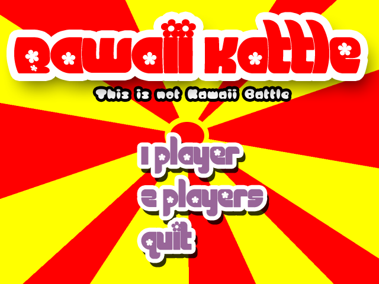

# bawaii_kattle
Special version of the game Kawaii Battle dedicated to tests and experiments.

## Presentation
Bawaii Kattle is a video game for up to 2 players. Each player selects 3 characters in a roster of 20, then go on to fight each other in a turn-based fashion.

## How to play

## Characters
