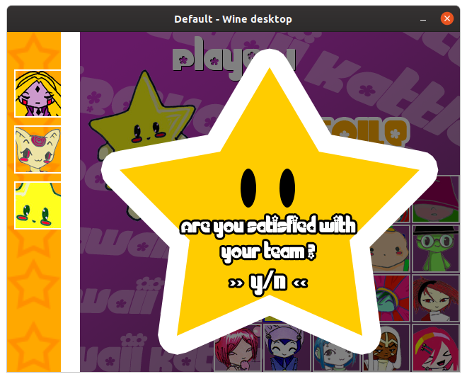

# bawaii_kattle
Special version of the game Kawaii Battle dedicated to tests and experiments.

## Presentation
Bawaii Kattle is a video game for up to 2 players. Each player selects 3 characters in a roster of 20, then go on to fight each other in a turn-based fashion.

## How to play
The game is played with the keyboard. Key mapping is as follows:

- UP, DOWN: Select option in menu
- ENTER: Validate choice
- 1, 2, 3, 4, 5: Select the type of attack
- ESC: Quit the game

## Characters
There are 20 playable characters, each with unique characteristics.
Check the [characters index](https://github.com/TME520/bawaii_kattle/blob/master/Characters%20index.pdf) for details.
